# bamazon
HW Assignment 10 - Node.js &amp; MySQL  

## Overview Description
Homework Assignment 10 - Bamazon

SMU Programming Bootcamp Spring 2019

The purpose of this assignment is to create a node.js based Amazon-like storefront utilizing the MySQL database software. The app is comprised of 3 programs:
- bamazonCustomer.js: manages customer orders and depletes stock from the store's inventory. 

- bamazonManager.js: allows a manager to check product inventory, add inventory, and add new products

- bamazonSupervisor.js: allows a supervisor to track product sales across the store's departments and provide a summary of the departments' sales in the store.
  
Please see the Homework-Instructions.md file for the specific assignment requirements.

## Node Packages Used
The following packages are needed (npm install) to run the program

   * [DotEnv](https://www.npmjs.com/package/dotenv)

   * [Request](https://www.npmjs.com/package/request)

   * [MySQL](https://www.npmjs.com/package/mysql)

   * [Colors](https://www.npmjs.com/package/colors)

## Prior to Running the Program
- The MySQL software requires a password to access the database. Create a file named `.env`, add the following to it, replacing within the quotes, the MySQL password:

```

MySQL_PW="TheMySQLPassword"

```
- Run the bamazonSchema.sql file in MySQL to create and populate the initial databases for the bamazon programs.

## Instructions for running the Programs from the BASH command line.
Be sure to install the above listed packages.

### Running the bamazonCustomer.js Program from the BASH command line.
In the project directory, the bamazonCustomer.js program can be executed at the command line with "node bamazonCustomer.js"

*  The app will first display, in a table, all of the items available for sale. Include the ids, names, and prices of products for sale.

* The app then prompts the user with 2 messages.
   * The first asks the customer the ID of the product they would like to buy.
   * The second message asks how many units of the product they would like to buy.
   * The user can quit the app by entering "q" [for quit] for either of the questions

* Once the customer has placed the order, the app checks if the store has enough of the product to meet the customer's request.
   * If not, the app notifies the customer of `Insufficient quantity!`, and then prevents the order from going through.

* However, if the store _does_ have enough of the product, the order is processed.
   * This means updating the SQL database to reflect the remaining quantity.
   * Once the update goes through, the customer is given the total cost of their purchase.

### Running the bamazonManager.js Program from the BASH command line.
In the project directory, the bamazonManager.js program can be executed at the command line with "node bamazonManager.js"

* This app provides the user with a set of menu options:

    * View Products for Sale
    * View Low Inventory
    * Add to Inventory
    * Add New Product
    * Exit the Program

  * If the user selects `View Products for Sale`, the app lists every available item: the item IDs, names, prices, and quantities.

  * If the user selects `View Low Inventory`, the app lists all items with an inventory count lower than five.

  * If the user selects `Add to Inventory`, the app prompts to allow the manager "add more" of any item currently in the store.

  * If the user selects `Add New Product`, the app allows the manager to add a completely new product to the store.

  * If the user selects `Exit Program`, the app exits

### Running the bamazonSupervisor.js Program from the BASH command line.
In the project directory, the bamazonSupervisor.js program can be executed at the command line with "node bamazonSupervisor.js"

* This app provides the user with a set of menu options:

   * View Product Sales by Department
   * Create New Department
   * Exit Program

* When the user selects `View Product Sales by Department`, the app displays a summarized departmant product sales table, sorted by department id, in the terminal/bash window.

* When the user selects `Create New Department`, the app prompts for the new department information

## Program Functionallity and Test 

The following are screen captures showing program functionality and requirement completion.

### bamazonCustomer.js

Product listing table and customer prompt
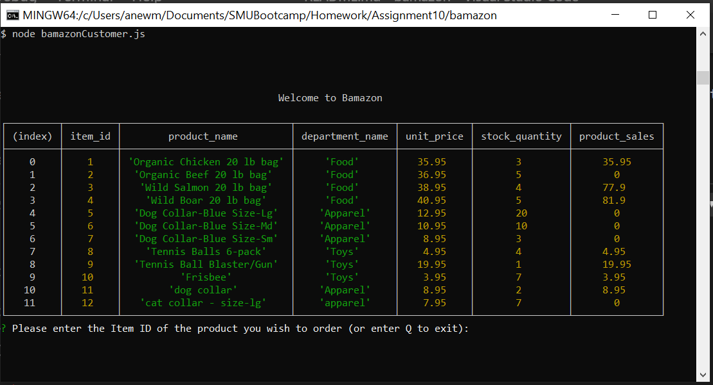

Transaction completed and updated product table
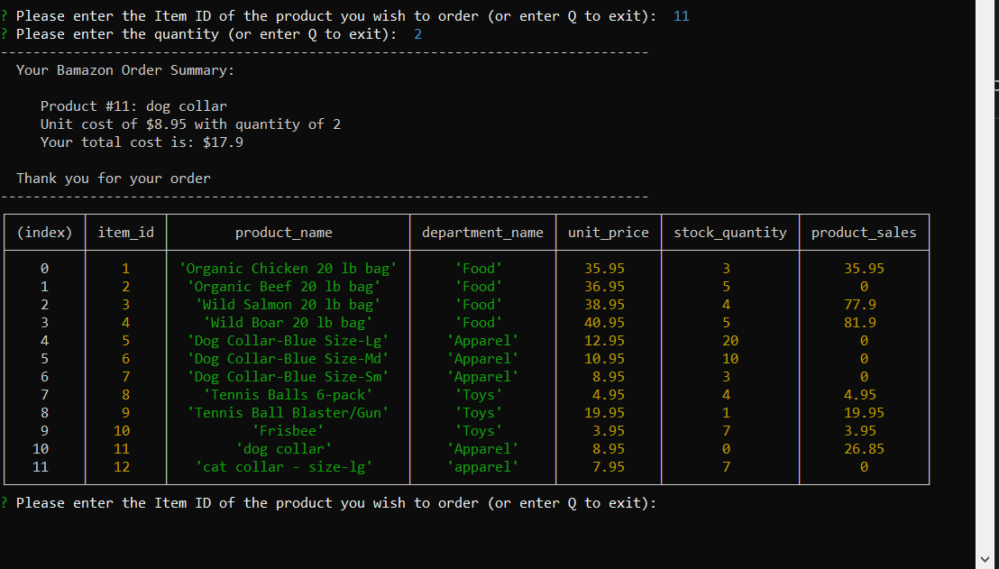

Not enough inventory to order and exit from the program
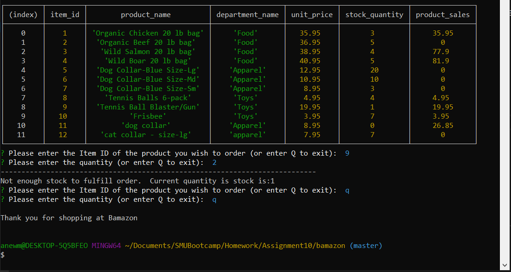

### bamazonManager.js

View Products for Sale
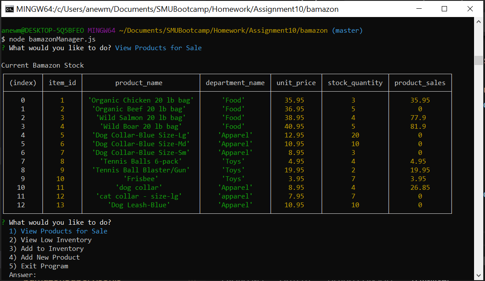

View Low Inventory
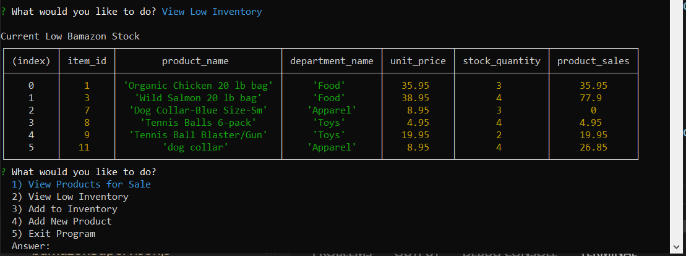

Add to Inventory
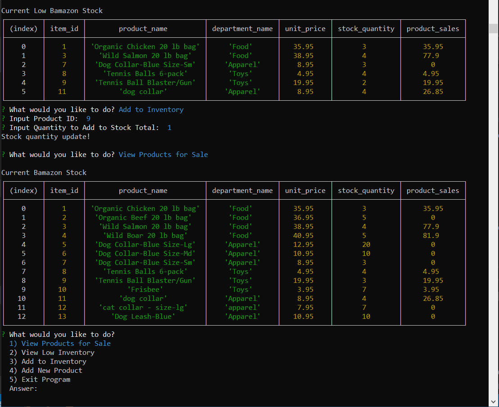

Add New Product
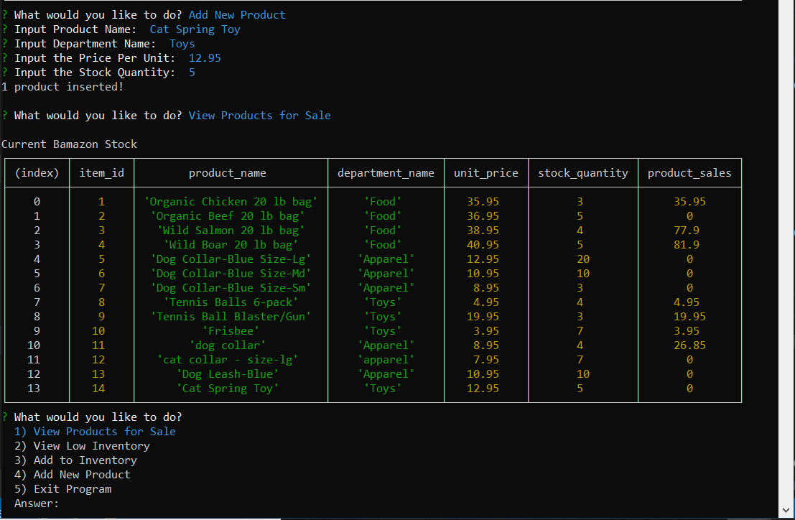

Exit the Program
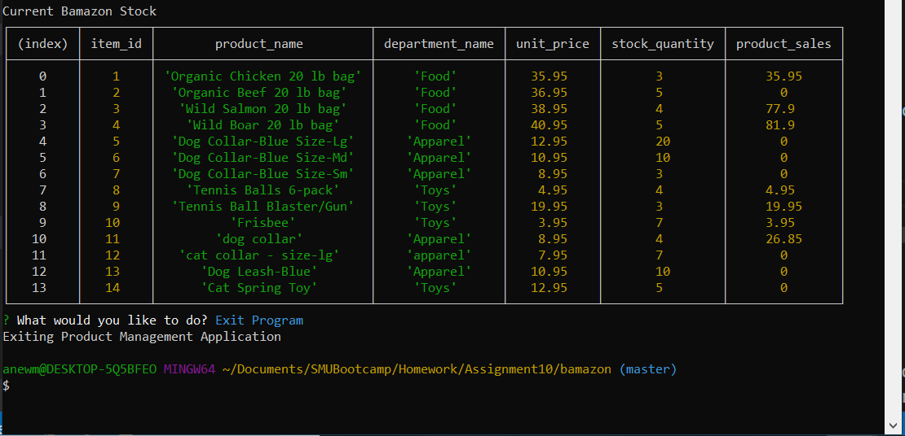

### bamazonSupervisor.js

View Product Sales by Department
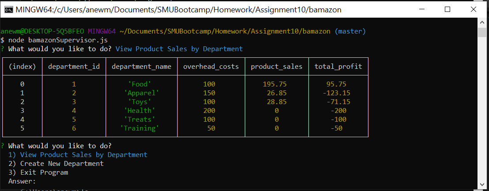

Create New Department
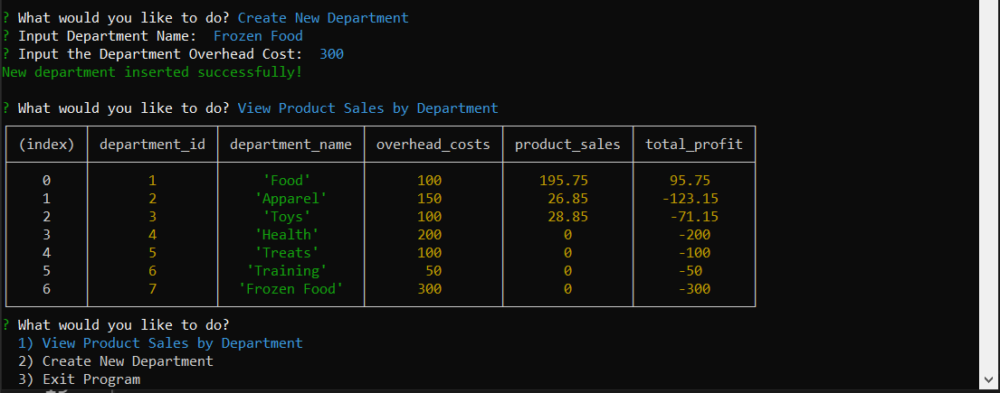

Exit Program
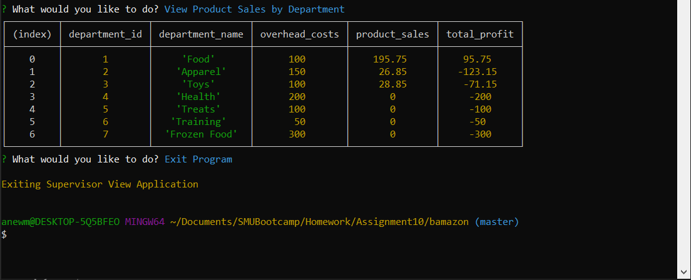


